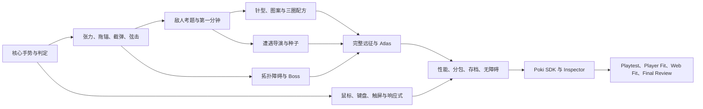

# LOOPLASH 开发路线图

> 文档用途：定义从风险验证、MVP、可投稿版本到后续更新的开发顺序与验收门。  
> 当前阶段：只做规划，不开始编写代码。  
> 原则：路线图按依赖与风险排序，不因工期、成本或团队规模主动削弱最终设计；尚未通过核心手感 Gate 时，也不提前大量生产内容。

## 1. 路线图总览

| 阶段 | 主要问题 | 交付结论 | 进入下一阶段的硬门 |
|---|---|---|---|
| 0. 设计锁定 | 一句话、规则、边界是否一致？ | GDD、Poki 清单、路线图 | 三重终审 ≥ 90；无致命设计风险 |
| 1. Core Feel 原型 | 单指画圈是否可靠且爽？ | 60 秒灰盒、输入/几何基准 | 首圈成功与判定可信度达标 |
| 2. MVP 垂直切片 | 核心能否支撑 5–10 分钟？ | 1 生态完整可玩闭环 | 第二局、首 Boss、Build 与移动端通过 |
| 3. 系统 Alpha | 架构和内容语法能否扩展？ | 4 生态框架、完整远征、工具链 | 10 分钟不机械、性能预算稳定 |
| 4. 内容 Beta | 可投稿内容是否齐全？ | 全部敌人、Boss、图案、Atlas、语言 | 内容/存档/兼容 P0/P1 归零 |
| 5. Poki 集成候选 | 平台生命周期、广告、体积是否合规？ | Inspector clean build | Poki Checklist Go/No-Go 全通过 |
| 6. Playtest 迭代 | 真实玩家是否快速理解并愿意重开？ | 多轮录像、指标、修订记录 | Baseline、Onboarding、Difficulty Gate |
| 7. 投稿与分阶段测试 | 是否有 Player/Web Fit？ | P4D 版本、缩略图、测试结果 | 按 Poki 流程推进，不预设接受 |
| 8. Soft/Global Release | 大规模环境是否稳定？ | 发布版本与快速修复管线 | Poki 审核与发布安排通过 |
| 9. 上线后更新 | 新内容是否提高而非稀释核心？ | 生态、Boss、挑战、获批联网功能 | 数据与玩家反馈证明方向有效 |

## 2. 阶段 0：设计锁定（当前完成）

### 交付物

- `GAME_DESIGN.md`：候选方向、三轮自评、完整规则、终审评分。
- `POKI_CHECKLIST.md`：只基于官方文档的现行规则、Inspector、Playtest 和提交门。
- `DEVELOPMENT_ROADMAP.md`：实现顺序与每阶段退出条件。

### 已锁定的不变量

1. 宣传语与核心动词：画圈、松手、把捕获对象织成下一次攻击。
2. 锚星是生命主体，针星和绳是可操作工具。
3. 单指、鼠标单独、键盘都能完成全部核心玩法。
4. 技巧成长高于永久数值成长；针型和图案是侧向选择。
5. 首分钟不展示三圈配方，不弹传统卡牌菜单，不出现广告入口。
6. 不引入传统背包、消耗品栏、金币商店、签到、基地建设或主动技能按钮。
7. 模拟、渲染、输入、平台、存档和 UI 分层。
8. 投稿版无必需外部服务器、无强制登录、无未经批准第三方请求。

### 允许由测试调整的变量

绳长、路径点数、张力区间、拖锚速度、回收时间、受击无敌、敌人节拍、分数倍率、首分钟波次时序、图案候选权重和动态援助范围。改变这些数值不得破坏上面的不变量。

## 3. 阶段 1：Core Feel 原型

### 3.1 实现顺序

1. 固定步进模拟空壳和动作状态：待机、放针、拖锚、收紧、回收。
2. Pointer/Touch 相对输入；鼠标与触屏先同一路径，键盘随后映射到同一动作。
3. 路径采样、简化、48 点重采样、自动闭合、实时填色。
4. 圆形目标包围判定、宽容半径、闭合弦线段判定。
5. 锚星拖拽物理、张力曲线、甜区和过张力弱收紧。
6. Puff、慢子弹、Shellbud 三种最小对象；截线吸弹和护结。
7. 收紧动画、hit-stop、基础音效、手指/鼠标幽灵教学。
8. 第一笔触发的本地生命周期假接口，确保未来平台适配不侵入玩法。
9. Android/iOS 真机采样工具与“视觉路径＝逻辑路径”调试叠层。

### 3.2 不做的内容

不做 Atlas、多个生态、完整 UI、广告、配方、动态难度、世界规则或大量美术。此阶段任何内容扩充都不能替代手感和判定验证。

### 3.3 核心测试样本

- 三只静止 Puff：验证首次成功。
- 五只移动 Puff＋一只应排除炸果：验证集合意图。
- 一枚慢弹：验证绳线截弹。
- Shellbud 背部护结：验证闭合弦。
- 大圈/小圈并列：验证双向收益。
- 模拟 30 FPS、触控抖动、旋转和误多指：验证稳健性。

### 3.4 Exit Gate

- 30 名未指导玩家中，80% 在 8 秒内完成第一圈；70% 无文字理解松手。
- “明明圈到却没算”的争议低于 5%；所有争议能由预览提前看出结果。
- 鼠标与触屏同一场景的成功率差距 ≤ 10 个百分点。
- 30 FPS 下路径不跳、松手延迟 P95 ≤ 80 ms、无手势丢失。
- 至少 70% 玩家自发连续画 10 圈以上，而不是完成提示后停手。
- 未达标时只允许继续调核心；不得进入内容生产。

## 4. 阶段 2：MVP 垂直切片

MVP 不是“只有一个机制的试玩”，而是能证明入口、十分钟深度、失败重开、Build、Boss、移动和平台边界的完整垂直切片。

### 4.1 MVP 内容范围

- 生态：绒星草甸一套完整视觉和关卡语法。
- 针型：晨针、双尾针、月梭针。
- 普通对象：Puff、Needler、Skipper、Splitter、Shellbud、Bomb Bloom、幼星。
- 精英：Knot Knight、Storm Spool。
- Boss：Tanglejaw 完整三阶段。
- 地图：Knot Post、Soft Wall、一个 Current Belt。
- 主目标：群捕、弦击、救援/排除三种。
- Build：12 枚图案、六格星织盘、5 个三圈配方、4 个接缝。
- 世界规则：3 个微规则，用于保证第二局重织。
- 模式：普通 6 节点远征、本地每日种子雏形。
- 局外：单张 Atlas 最小路径、3 个技巧节点、针型解锁、设置和存档。
- 输入：鼠标、键盘、单指；横屏和竖屏原生布局。
- 平台：Poki 适配接口、生命周期状态机、广告占位、`measure()` 事件设计。

### 4.2 MVP 玩家流程

加载→第一笔→60 秒场内织选→路线门→图案组合→精英→三圈配方→Tanglejaw→胜利 Atlas；任意失败→图形回放→重织开局→20 秒内看见不同针型/布局/规则。

### 4.3 MVP Exit Gate

- 第一可玩包预计体积已能投影到 ≤ 4.5 MB；无临时大资源掩盖风险。
- 10 分钟内至少出现 6 类可辨决策，不只增加敌人数量。
- 第二局前 20 秒至少两个维度与上一局不同，玩家能在访谈中说出差别。
- 三个针型各有使用者和独特圈路，不存在纯强弱顺序。
- 大圈、小圈在高分录像中都被主动使用；任何一种占比 >80% 时重新平衡。
- Boss 的主要失败原因是可学习的拓扑/时机，不是长血条或不可读弹幕。
- 单指可无辅助通关；键盘和鼠标均能完成同一 Boss 技巧。
- 20 分钟中端手机压力测试 ≥30 FPS，无存档丢失、黑屏、输入锁死。

## 5. 阶段 3：系统 Alpha

### 5.1 架构完成顺序

1. Simulation/Renderer/Input/UI/Platform/Asset/Save/Telemetry 模块接口冻结。
2. 稳定 manifest key、生态分包和依赖图；禁止玩法代码引用文件路径。
3. 遭遇导演语法：主考题、辅考题、惊喜、喘息窗、冲突过滤、防重复。
4. 确定性种子和挑战模式；保存最终生成序列供重放。
5. 星织盘、配方和世界规则数据驱动化，仍由模拟层执行。
6. 自动质量阶梯、对象池、空间哈希、路径网格复用、context loss 恢复。
7. 存档 schema、迁移、校验、备份、localStorage/IndexedDB/内存降级。
8. DOM UI 焦点、键位重映射、语言热切换和无障碍设置。
9. 生命周期协调器和平台假实现单元/集成测试。

### 5.2 内容框架

四生态都建立至少一个灰盒节点；14 普通敌人、6 精英、3 Boss 的行为原型全部可运行，即使美术仍为占位。36 图案先完成数据与效果轮廓，再做最终特效。所有新内容必须填写：主考题、反制动作、与哪种旧内容冲突、移动遮挡风险、性能预算。

### 5.3 Alpha Exit Gate

- 完整 6 节点远征可从任意种子启动、保存、恢复和重放。
- 遭遇导演连续 1000 种子无无解、无首帧伤害、无相同主考题三连。
- 同种子同输入日志得到相同模拟结果和分数。
- 四生态在低端质量档均稳定 ≥30 FPS；切换两次后内存回落，无持续泄漏。
- SDK 假实现的所有事件路径无重复 Start/Stop，广告锁期间无输入。
- 10 分钟观察中玩家能识别新问题，而非只说“怪更多、更硬”。

## 6. 阶段 4：内容 Beta

### 6.1 可投稿内容清单

- 4 个完整生态、14 普通敌人/中立对象、6 精英、3 Boss。
- 6 针型、36 图案、至少 20 接缝/家族织法、12 世界规则。
- 5 主目标、路线契约、8–12 分钟普通远征、12–18 分钟挑战远征、无尽模式。
- 单一 Atlas：技巧、针型、图案、生态、外观节点。
- 每日种子、本地历史、Poki shareableURL 同种子挑战。
- 11 个本地化语言包及字体子集。
- 高对比、色觉纹样、粗绳、减少动态、镜头震动、粒子、震动、音量分轨、键位重映射。
- 静态缩略图候选 3 套、动态缩略图实际游戏录制脚本和镜头清单。
- 所有音乐、音效、动画、反馈、暂停、旋转、后台恢复和存档迁移。

### 6.2 内容审查纪律

每一枚图案必须改变圈路、目标、时机或拓扑；每一种敌人必须迫使玩家改变画圈；每个世界规则必须改变至少两类遭遇但不能只是生命/伤害倍率。任何内容如果只能描述为“更高数值、更多掉落、不同颜色”，从投稿版删除或重做。

### 6.3 Beta Exit Gate

- 新玩家、30 分钟玩家、2 小时玩家分别能说出当前的短、中、长期目标。
- 6 针型胜率和选取率无单一支配；低选取项先查清晰度，再查强度。
- 36 图案无零互动废项；`visible/interact` 和录像共同验证。
- 所有语言无截断、烘字、字体缺字和错误回退。
- 存档从至少两个旧 schema 迁移成功；损坏时恢复备份或进入安全默认。
- P0/P1 缺陷为零，P2 有明确归属和处理结论。

## 7. 阶段 5：Poki 集成候选

### 7.1 集成顺序

1. 锁定当前已验证的 Phaser 3、Vite 和 `@poki/phaser-3` 版本。
2. SDK 尽早初始化，失败仍继续；StarterPack 就绪后一次 `gameLoadingFinished()`。
3. 保持显式 LifecycleCoordinator；第一笔真实 `deploy` 才 `gameplayStart()`。
4. 死亡、暂停、阻断菜单、过场、页面隐藏/失焦统一 Stop。
5. 重开、恢复、大生态门和完整远征后继续接 commercial Promise。
6. 复苏、重织候选接 rewarded Promise，只有成功发奖。
7. 广告锁控制模拟、音频、键鼠触摸和震动，恢复原声音偏好。
8. 接入 `measure()` 稳定事件和 shareableURL；不接第三方分析。
9. 构建 clean mode，移除 debug、源映射、测试资源和开发 UI。

### 7.2 Inspector 矩阵

- 首次输入、暂停/恢复、死亡/重开、完整远征、商业广告占位。
- 激励成功、失败、跳过、广告拦截。
- Desktop Mode、Mobile QR 真机、Scaling Tests、隐身模式。
- 旋转、失焦、context lost、慢网、分包失败、存储失败。
- Event Log、外部资源、图片优化、Unexpected Behavior 告警。

### 7.3 集成 Exit Gate

以 [POKI_CHECKLIST.md](./POKI_CHECKLIST.md) 的 Go/No-Go 为唯一准入表。特别是：首包项目目标 ≤4.5 MB 且不超过官方 8 MB 目标；最低 30 FPS/目标 60；Inspector 生命周期无告警；无外部请求；隐身模式可玩；标准继续按钮层级正确。

## 8. 阶段 6：Playtest 迭代计划

### 批次 1：Core Baseline

假设：没有说明的玩家会因为画圈本身继续数分钟。10 份 Poki 录屏＋内部对照。看会话时长、第一圈、玩家是否自发试验圈大小。若失败，回 Core Feel，不加元系统。

### 批次 2：Onboarding

假设：首 60 秒按顺序学会圈、截弹、弦击和场内织选。看 <1 分钟退出与错误动作。若失败，重排场景、减少同时刺激，不用文本墙。

### 批次 3：Second Run

假设：第一次失败后愿意立刻重开，且 20 秒内感到不同。看重开率、重织针型选择、教程是否重复。若失败，加强保证差异，不提高永久奖励。

### 批次 4：Ten-Minute Depth

假设：玩家在十分钟继续切换大/小圈、配方、路线和拓扑技巧。看操作分布、Build 支配、Boss 失败。若机械化，先改敌人/目标关系，不继续加图案数量。

### 批次 5：Input and Accessibility

假设：鼠标、键盘、单指和色觉/减少动态模式都能公平完成。按输入分组比较成功率与分数；差距来自映射时修映射，不用隐藏数值补偿。

### 批次 6：Performance and Platform

假设：中端手机和普通网络达到 POKI_CHECKLIST 预算。做 20 分钟压力跑、首包和分包失败、后台、旋转、广告锁、存档限制。

每批只设一个主要假设；结果必须形成“问题→修改→新录像”的闭环。至少观看 5 份 Level 2 录屏后才申请 Player Fit。

## 9. 阶段 7：Poki 投稿与数据阶段

1. 在 P4D 添加游戏，填写标题、描述、最多四个建议分类和版本。
2. 使用 Playtesting 完成 Baseline/Onboarding/Difficulty；逐份观看录屏。
3. 申请约 500 人 Player Fit，关注 3–5 分钟和 5 分钟以上分布；不达标继续迭代。
4. 上传静态缩略图并通过前置后，申请约 10,000 人 Web Fit；预计 3–5 天。
5. 同时评估 CTR、Average Time on Page、Conversion to Play，相对分类动态基准判断。
6. 通过 Web Fit 仅代表潜在适配；等待 1–2 周 Final Poki Review，评估质量和分类内原创性。
7. 未通过时尊重结论；若允许再次测试，只有实质修改后提交新版本，不做表面换皮。

## 10. 阶段 8：Soft Release 与 Global Release

如果 Poki 最终接受并安排发布：

- 必要时先做 Technical Test；对多人/新技术尤为重要，本项目原则上可凭离线架构降低该风险。
- Soft Release 是强制阶段。监控 C2P、参与时长、错误、玩家反馈和商业/激励结构；保持新版本快速上传与审核能力。
- 动态缩略图在全球发布前完成并通过要求；用实际画圈、收紧、图案、Boss 画面。
- Global Release 后继续监控错误和内容表现；性能或存档 P0 走热修优先通道。
- 不把“已发布”理解为无需更新，也不把“指标不佳”只归因于广告或流量。

## 11. 后续更新顺序

### 更新 A：新拓扑，而非更多数值

新增一个“折纸云港”生态、2 个改变线段连通性的障碍、3 个敌人和 1 个 Boss。优先验证新拓扑与旧针型都有解，不增加更高稀有度装备。

### 更新 B：针型与图案重组

新增 2 针型和 12 图案，但同时审计旧图案互动率；低价值旧内容重做，不让池无限稀释。增加“限定图案池”挑战，让玩家深入掌握而非只追新。

### 更新 C：异步挑战

扩展 shareableURL 规则、好友目标线和幽灵闭合弦；无聊天。若需要全球榜或跨设备存档，先申请 Poki 批准、完成隐私政策和防作弊，再接第一方/获批服务。

### 更新 D：高阶世界规则

加入镜像输入、脆绳、双锚星等专家规则，只在玩家主动选择的挑战模式出现；不污染普通首局。

### 更新 E：回归内容

新增 Atlas 分支、生态档案、外观线色和 Boss 精通；无签到、无付费通行证、无永久攻击数值。

## 12. 生产依赖关系

关键路径始终从核心判定开始。美术、音频和内容可以在核心 Gate 后并行，但不得绕过核心失败继续堆量。

## 13. 各工作流 Definition of Done

### 玩法

- 玩家行为、反馈、失败、反制和高手表达都可描述。
- 新系统服务画圈核心，不能只提供数值或菜单管理。
- 鼠标、键盘、触屏均有实测录像。

### 内容

- 填写主考题、辅考题、冲突表、性能预算和首次教学。
- 进入导演 1000 种子模拟，无无解、无不公平首击。
- 至少一项旧机制与新内容产生有意义的新组合。

### UI/本地化

- DOM 焦点、触控 48 px、40% 文本膨胀、11 语言无截断。
- 不靠颜色或声音单一通道。
- 核心画面不被 HUD 或 Poki Pill 遮挡。

### 技术

- 固定步进可重放，模拟与渲染无反向依赖。
- 预算、内存、GC、context loss、慢网和存储失败测试通过。
- clean build 无 debug、源映射、外部资源和未捕获错误。

### Poki

- Lifecycle Event Log 全路径正确、无重复、广告中无事件。
- 首包、16:9、手机/平板、隐身、广告、缩略图和 Playtest 清单全过。
- 任何“官方要求”都可追溯到 `POKI_CHECKLIST.md` 的官方链接；项目内控不冒充平台门槛。

## 14. 最终开发优先级

1. 判定可信度。
2. 松手手感和第一分钟。
3. 单指/鼠标/键盘公平性。
4. 大小圈风险、第二局差异和十分钟深度。
5. 拓扑 Boss 与构筑职责边界。
6. 固定步进、种子、存档、性能和分包。
7. 内容规模、Atlas、本地化和无障碍。
8. Poki SDK、Inspector、Playtest 和提交流程。
9. 获得真实数据后继续修订；不以文档评分代替玩家验证，也不预设 Poki 接受。
